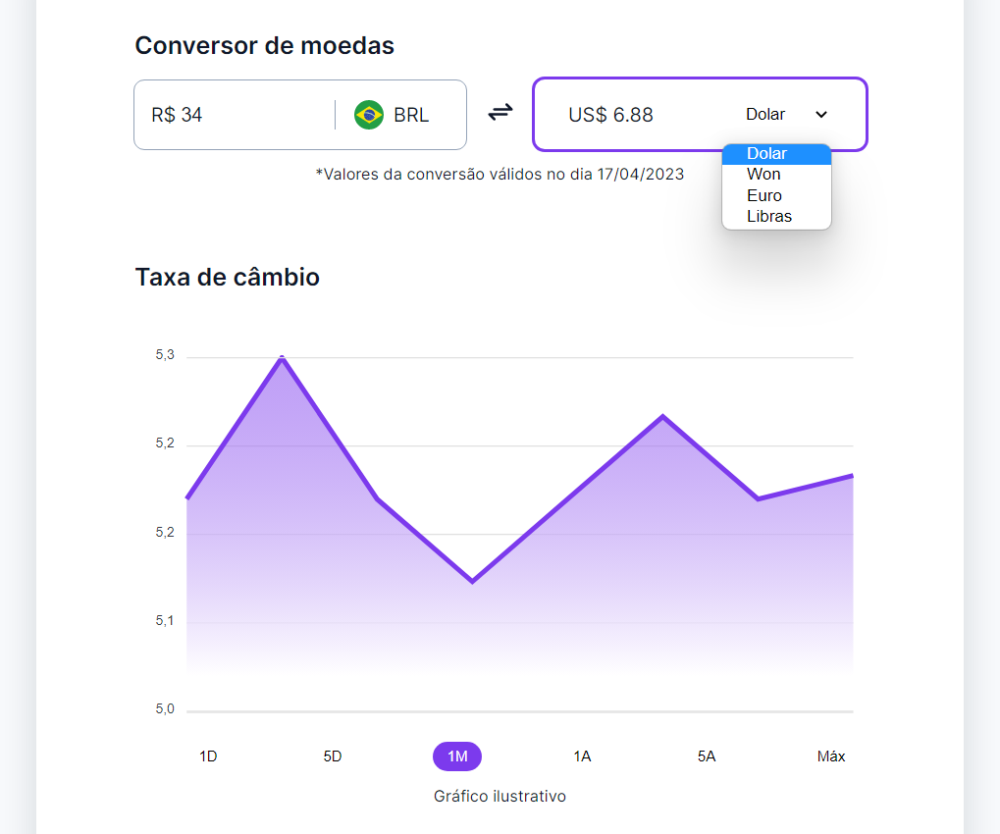

# Criação de um Conversor de moedas funcional
O presente projeto está sendo desenvolvido com a ajuda da Rocketseat afim de expandir meu aprendizado em HTML5, CSS3 e JavaScript.

## Tecnologias utilizadas
- HTML5
- CSS3
- JavaScript
- Figma
## Layout
- Foi utilizado esse layout do figma como base para o projeto: [Conversor](https://www.figma.com/community/file/1212757179376046656)

### Layout final
