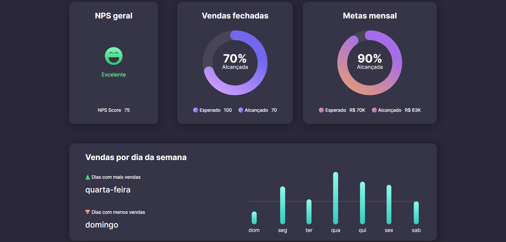

# Criação de um Dashboard
O presente projeto foi desenvolvido com a ajuda da Rocketseat afim de expandir meu aprendizado em HTML5 e CSS3.s
## Tecnologias utilizadas
- HTML5
- CSS3
- Figma
## Layout
- Pra o Dashboard foi usado este projeto do figma como base [Dashboard](https://www.figma.com/community/file/1210217615683203825)

### Layout final

