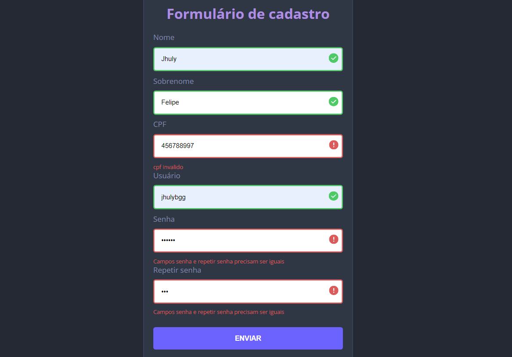

# Validação de formulário
O presente projeto foi desenvolvido afim de expandir meu aprendizado em HTML5, CSS3 e JavaScript.

## Tecnologias utilizadas
- HTML5
- CSS3
- JavaScript

## Layout
- Foi utilizado o layout desse projeto: [javascript-form](https://github.com/gabrieldiasss/javascript-form) como base.

### Layout final

