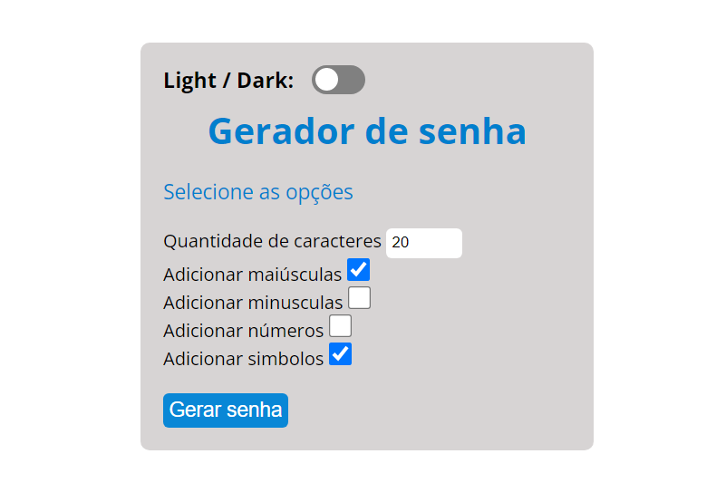
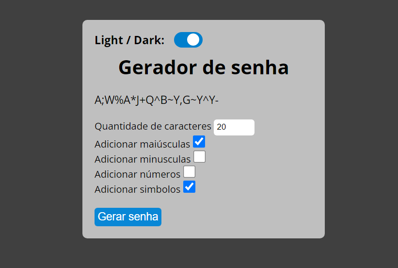

# Gerador de senhas
O presente projeto foi desenvolvido afim de expandir meu aprendizado em HTML5, CSS3 e JavaScript.

## Tecnologias utilizadas
- HTML5
- CSS3
- JavaScript

## Execução
Basta clonar esta repositótio e abrir o arquivo index.html no navegador.

## Layout
O layout dark foi desenvolvido com base no projeto da rocketseat: [Dark/mode](https://gist.github.com/maykbrito/f3744039fcc20db62d6cfd502aa2bc86)

### Layout light

### Layout dark

