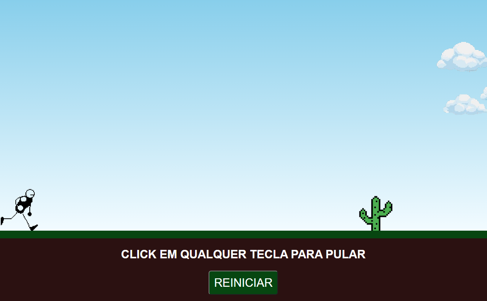

# Jogo do dino
O presente projeto está sendo desenvolvido afim de expandir meu aprendizado em HTML5, CSS3 e JavaScript.

## Tecnologias utilizadas
- HTML5
- CSS3
- JavaScript

## Execução
Basta clonar esta repositótio e abrir o arquivo index.html no navegador.

## Layout do jogo

## Créditos à:

- [nuvens](https://pt.vecteezy.com/arte-vetorial/9877965-pixel-art-cloud-vector-icon-for-8bit-game-on-white-background)
- [obstaculo](https://www.pixilart.com/debiydiego/albums/obstaculos-11666)
- [personagem](https://www.devsway.com.br/post/o-fim-da-semana-1)
- [jogo base](https://www.youtube.com/watch?v=r9buAwVBDhA&ab_channel=ManualdoDev)
