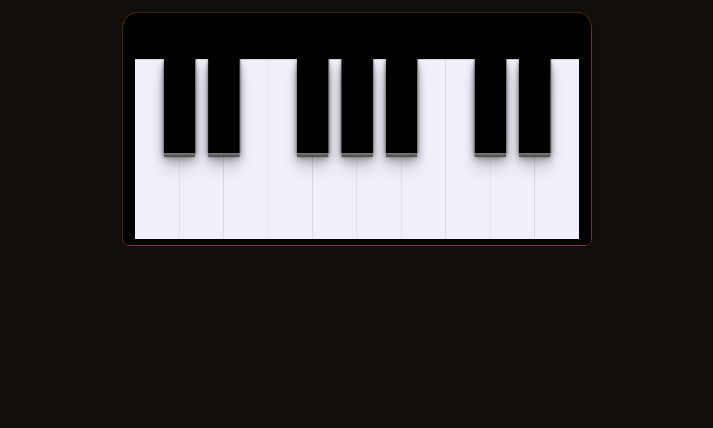

# Criação de keyboard
O presente projeto foi desenvolvido com a ajuda da Rocketseat afim de expandir meu aprendizado em HTML5, CSS3 e JavaScript.

## Tecnologias utilizadas
- HTML5
- CSS3
- SASS
- JavaScript
## Layout
- Foi utilizado layout disponibilizado pela rocketseat.

### Layout final

