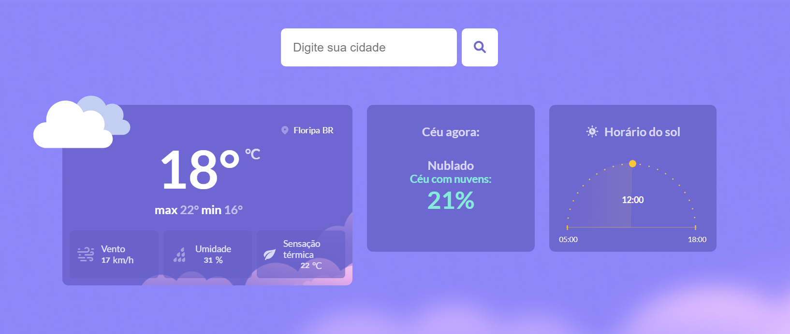

# Criação de uma página de clima
O presente projeto foi desenvolvido afim de expandir meu aprendizado em HTML5, CSS3 e Javascript. Nele API do [openweathermap](https://openweathermap.org/api)

## Tecnologias utilizadas
- HTML5
- CSS3
- JavaScrpit
- Figma

## Execução
Basta clonar esta repositótio e abrir o arquivo index.html no navegador.

## Layout
Foi utilizado esse layout do figma como base para o projeto: [Página de clima](https://www.figma.com/community/file/1215291914714743267)

### Layout final

