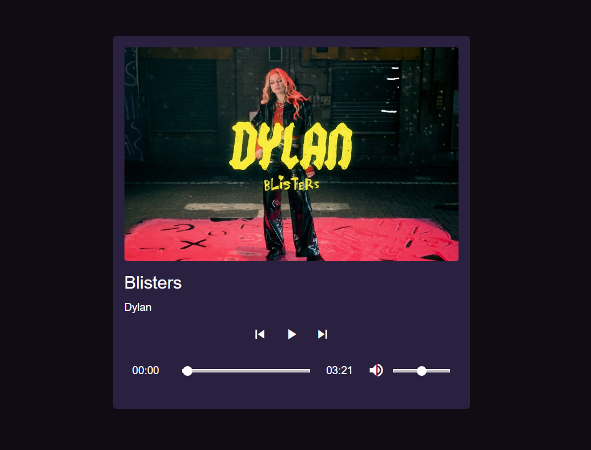

# Criação de um player de música
O presente projeto foi desenvolvido com a ajuda da Rocketseat afim de expandir meu aprendizado em HTML5, CSS3 e JavaScript.

## Tecnologias utilizadas
- HTML5
- CSS3
- JavaScript
- Figma

## Execução
Basta clonar esta repositótio e abrir o arquivo index.html no navegador.

## Layout
- Foi utilizado esse layout do figma como base para o projeto: [Player](https://www.figma.com/community/file/1195050524500542670)

### Layout final
